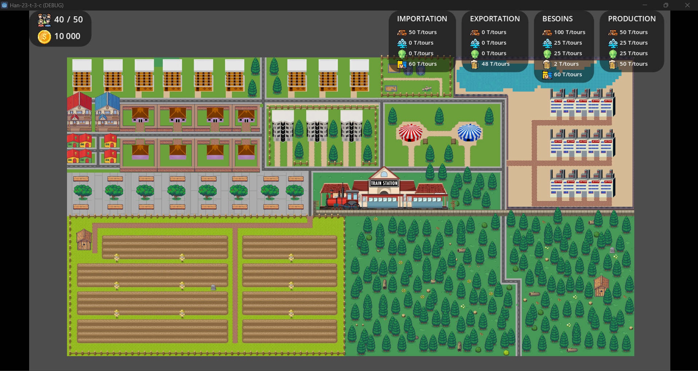
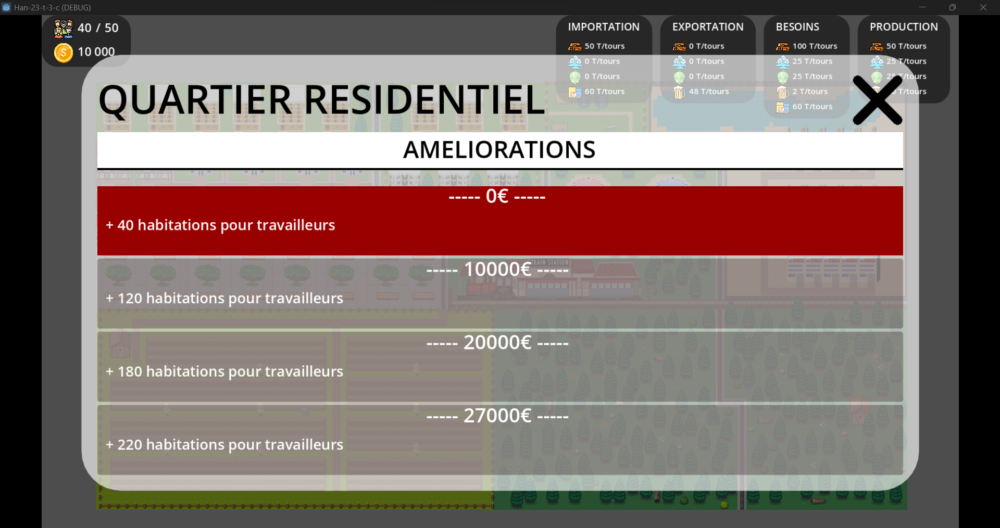
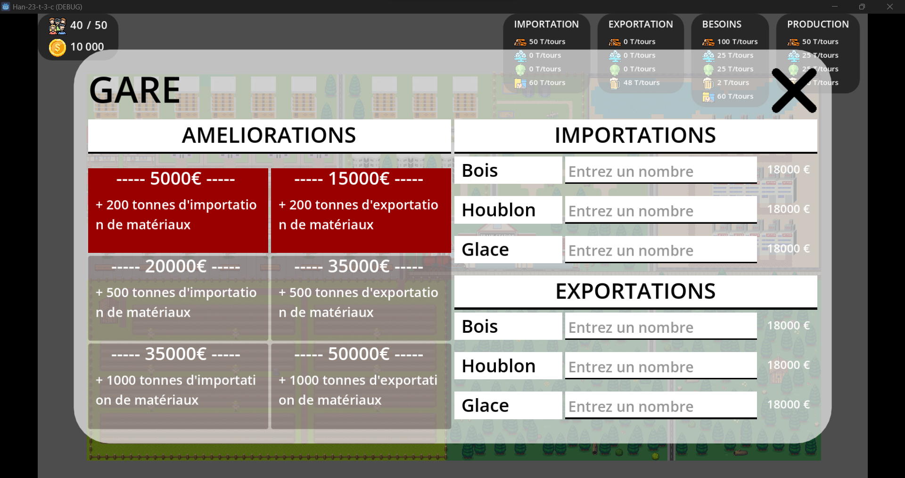

# Brassopolis

## Contenu du jeu

**Le but de Brassopolis** est de développer le quartier mis à votre disposition en utilisant la seule activitée économique de ce quartier : **la production de bière**
Pour cela vous avez à votre disposition 3 secteurs : 
- **Les résidences** : La partie résidentielle vous permets d'accueillir tous vos travailleurs, plus vous l'améliorez, plus vous pourrez accueillir d'habitants plus vos usines pourront produire en grosse quantité.
- **Les usines / agriculture** : Les usines vous permettent de produire les matériaux nécessaires à la production de bière, plus vos usines seront améliorés, plus leur production sera grosse, mais plus elle nécessitera de la main d'oeuvre.
- **La gare** : La gare vous permets de gérer l'importation et l'exportation de matériaux.

Votre but est de reterritorialiser ce quartier au mieux, de la façon dont vous voulez.

## Instructions d'installation
1. Se rendre sur le site de [Brassopolis](http://klebert-host.com:50007/)
1. Télécharger le bon fichier pour votre système
1. Lancer le .exe
1. Suivre les insctructions d'installations
1. Profiter du jeu
